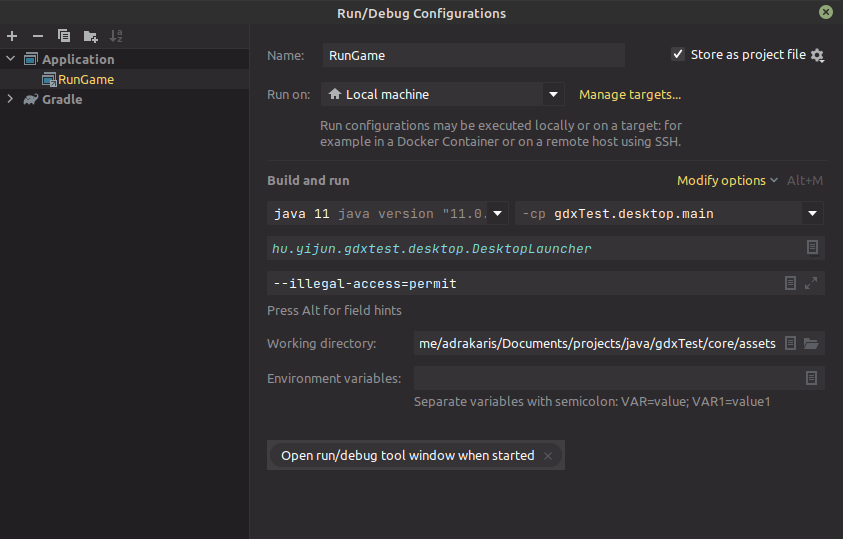

# Java LibGDX Test

I'm wanting something simple that I can use like pygame (but in a statically typed language)
and LibGDX has so far fit that pretty well.

This is just a kind of test repo of small things. This is only for desktop (as is).

## Included

* `hu.yijun.gdxtest.balls` **GdxTest.** A ball that bounces on the floor.
You can drag it around and let it go to let it bounce more.
* `hu.yijun.gdxtest.multiscreen` **MultiGame.** A (smaller) ball that moves around the screen and
bounces off the edges. Uses multiple screens, and so there is a title screen which is 
  pretty self explanatory.
* `hu.yijun.gdxtest.camerathing` **CameraThing.** Literally four squares and a camera that can be moved
with WASD, and zoomed and rotated with arrow keys. 
* `hu.yijun.gdxtest.slider` **Colours.** Same as the program as in the `Adrakaris/Small` repository, it has
three slider bars that you can slide (for RGB), and it'll change the colour of the background.

## Use

No binaries are provided with this - it's literally a test thing. If you want to
run any of these you're gonna have to mess around with source code, but only slightly.

First, when you load up the project, and if it's not already included, you will have to 
add a run configuration. I'm using IntelliJ IDEA, and so this is the 
corresponding run configuration window. Set it like so.

*Make sure the working directory is set to `/core/assets`*.



## Changing "Games"

Go to `desktop/src/.../DesktopLauncher.java` and change this specific line:

```java
new LwjglApplication(new Colours(), config);
```

where it says `Colours`, change that to the class name you want it to be.